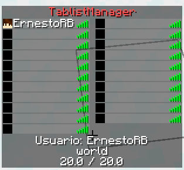

# TablistManagerAPI

TablistManagerAPI is a API for displaying content on tablists for SpigotMC servers. Depends on ProtocolLib.

## Features of the plugin



* Fill the tablist to a custom size (with empty slots aka fake players)
* Per world tablist (Only players within the World can see each others)
* Multiversion since is built on top ProtocolLib
* Header and footer manipulation (per-world)

## Features of the API

- All of the plugin but programmatically

## Developing a plugin using the API

You can use the tablistmanager-api package by itself (suitable for customization), or use the tablistmanager-plugin.

### Installing using Maven
The API and the Plugin are published to GitHub Packages. In order to access the packages you should follow this steps:

1. First, you should [create a personal access token](https://docs.github.com/es/authentication/keeping-your-account-and-data-secure/creating-a-personal-access-token) 
2. Then, authenticate with that token on your settings.xml, as described [here](https://docs.github.com/es/packages/working-with-a-github-packages-registry/working-with-the-apache-maven-registry#authenticating-to-github-packages)
```xml
<servers>
  <server>
    <id>github</id>
    <username>YOUR_GH_USERNAME</username>
    <password>YOUR_TOKEN</password>
  </server>
</servers>
```
3. Add the repository (to your settings.xml profile or to your project pom.xml)
```xml
<repository>
  <id>github</id>
  <url>https://maven.pkg.github.com/ErnestoRB/TablistManagerAPI/</url>
</repository>
```
4. Finally, add the dependency you need to your project POM (API or Plugin).

```xml
<dependencies>
   ...
   <dependency>
      <groupId>com.ernestorb.tablistmanager</groupId>
      <artifactId>tablistmanager-api</artifactId>
      <version>1.1.0</version>
   </dependency>
   ...
</dependencies>
```

```xml
<dependencies>
   ...
   <dependency>
      <groupId>com.ernestorb.tablistmanager</groupId>
      <artifactId>tablistmanager-plugin</artifactId>
      <version>1.1.0</version>
   </dependency>
   ...
</dependencies>
```

### Developing using the API
1. Declare the tablistmanager-api dependency to your plugin POM
2. Create an instance of TablistManager. There must be just one instance of this class, having more can lead to issues.
```java
  TablistManager manager = new TablistManager(this);
```
3. As the API depends on ProtocolLib, you need to make sure it gets loaded before. Add the following to your plugin.yml
```yaml
loadbefore: [ ProtocolLib ]
depend: [ ProtocolLib ]
```

### Developing using the plugin
Download the latest plugin available. (Releases tab)

1. Install the plugin downloaded before in you server plugin's folder.
2. Declare the tablistmanager-plugin dependency to your plugin POM.
3. In your plugin.yml add the following lines
```yaml
loadbefore: [ TablistManager ]
depend: [ TablistManager ]
```
3. Get the attached TablistManager instance of the TablistManagerPlugin.
```java
Plugin pl = this.getServer().getPluginManager().getPlugin("TablistManager");
if(pl != null && pl instanceof  TablistManagerPlugin) {
    this.manager = ((TablistManagerPlugin)pl).getManager();
} else {
    this.getLogger().severe("Plugin cannot be loaded due lack of TablistManager plugin");
    this.getPluginLoader().disablePlugin(this);
    return;
}
```

## Code examples

### Displaying header and footer
Get the TablistHandler attached to TablistManager (see [api usage](#developing-using-the-api) or the [plugin usage](#developing-using-the-plugin), define a template and send it to the player you want.

```java
public class HelloTablist extends TablistTemplate {

    private HelloTablist() {
        super((tablistTemplate, player) -> {
            // define new custom placeholder
            tablistTemplate.setHeader(tablistTemplate.getHeader().replaceAll("%new_placeholder%", player.getGameMode().toString()));
        });
        this.setHeader("&aHello!\n&eThis API is great %player_name%\nThis is my %new_placeholder% (gamemode)");
        this.setFooter("&cYou are on %player_world%"); // built in player placeholders
    }

    public static HelloTablist getInstance() {
        return new HelloTablist();
    }
}
```

This is how would look using the plugin.

```java
Plugin pl = this.getServer().getPluginManager().getPlugin("TablistManager");
if(pl != null && pl instanceof  TablistManagerPlugin) {
    this.manager = ((TablistManagerPlugin)pl).getManager();
    TablistHandler handler = this.manager.getTablistHandler();
    Player p = ...;
    handler.setPlayerTablist(player, HelloTablist.getInstance());
} else {
    this.getLogger().severe("Plugin cannot be loaded due lack of TablistManager plugin");
    this.getPluginLoader().disablePlugin(this);
    return;
}
```

### Adding slots (or "fake players")
If you want to display slots to a tablist, use the FakePlayers class.

#### If you want a "empty" slot
1. Use FakePlayer#randomFakePlayer() to create an instance of a FakePlayer
2. Add fake player to player's tablist with `FakePlayer#getTablistAddPacket().sendPacketOnce(Player)`
3. And to remove it use `FakePlayer#getTablistRemovePacket().sendPacketOnce(Player)`
#### If you want a slot with custom display name
1. Use FakePlayer(name, displayname) to create an instance of a FakePlayer
2. Add fake player to player's tablist with `FakePlayer#getTablistAddPacket().sendPacketOnce(Player)`
3. And to remove it use `FakePlayer#getTablistRemovePacket().sendPacketOnce(Player)`
